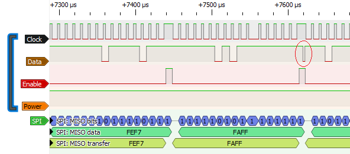
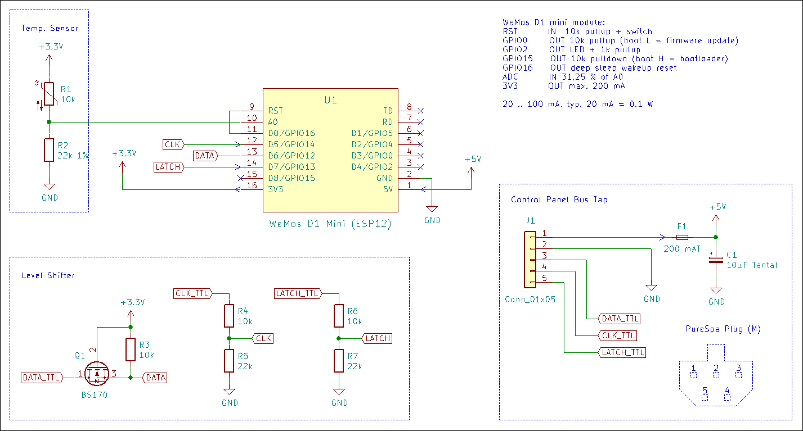
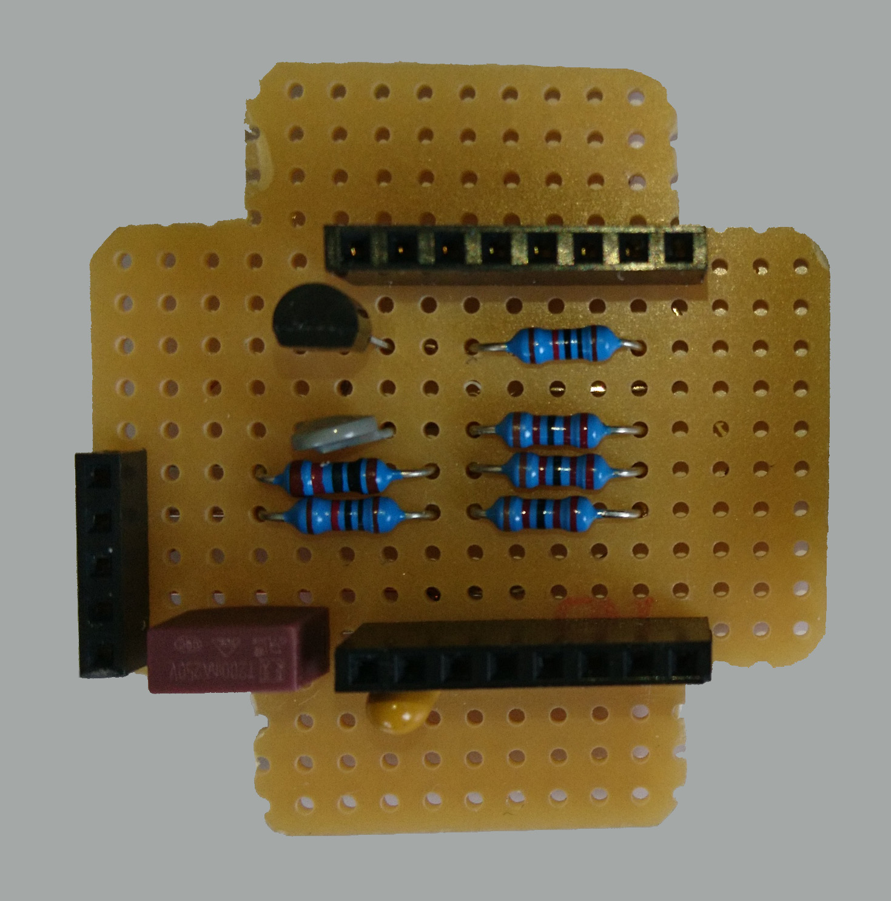
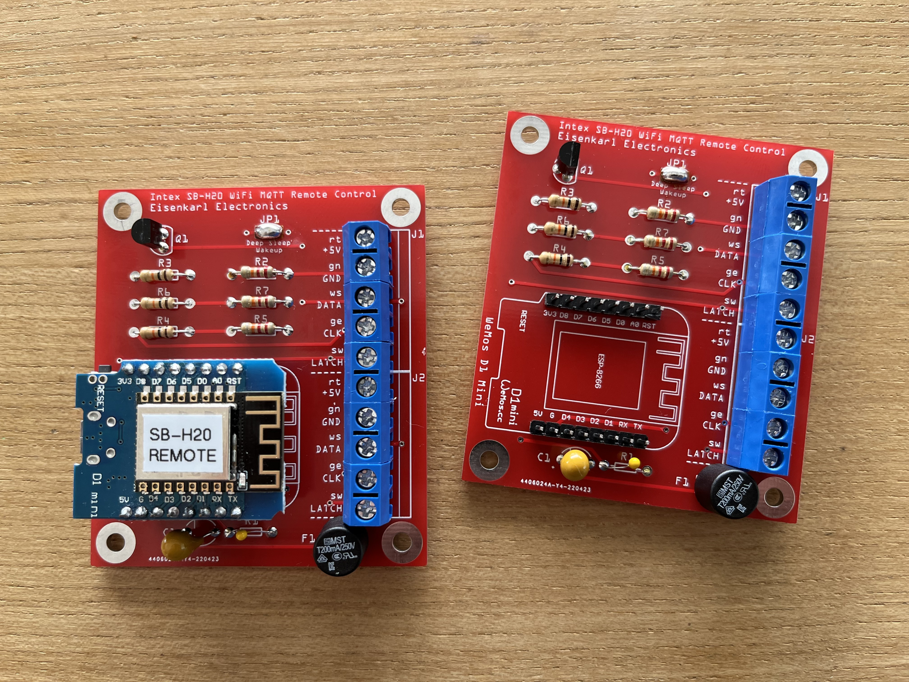

# MQTT WiFi remote control for Intex PureSpa whirlpools

[](https://github.com/jnsbyr/esp8266-intexsbh20/actions/workflows/build.yml)

### Table of contents

[1. Compatibility](#compatibility)  
[2. Introduction](#introduction)  
[3. Motivation](#motivation)  
[4. Hacking the SB-H20](#hacking-the-sb-h20)  
[5. Building your own WiFi remote control](#building-your-own-wifi-remote-control)  
[6. Contributing](#contributing)  
[7. Licenses and Credits](#licenses-and-credits)


## Compatibility

This projects was originally designed for the Intex PureSpa SB-H20 but it also
supports other models:

 Model                    | Define [^1]  | Notes
 ------------------------ |:------------ |:---------------------------------------------------
 Intex PureSpa SB-H20     | MODEL_SB_H20 | supported
 Intex SimpleSpa SB–B20   | MODEL_SB_H20 | reported to be compatible, see [issue #5](../../issues/5)
 Intex PureSpa SSP-H-20-1 | MODEL_SB_H20 | supported, see [issue #53](../../issues/53)
 Intex PureSpa SJB-HS     | MODEL_SJB_HS | supported, see [issue #13](../../issues/13)

[^1]: #define required for build (see [common.h](src/esp8266-intexsbh20/common.h))


## Introduction

The Intex PureSpa models listed under [Compatibility](#compatibility) are
standalone systems that do not have a remote control option. This projects
provides information about the required hardware and software to provide
WiFi remote control using the [MQTT](https://mqtt.org/) protocol.

This is no ready-to-use product. The acquisition of the required hardware
components, their assembly and programming requires some experience with DIY
 electronics. Helpful details can also be found in the
[issues](../../issues) of this project
(e.g. a table of the hardware components not shown in the schematic can be
found in [issue #2](../../issues/2)).

> :warning: **WARNING**: If you decide to implement the presented solution
  you will void the warranty of your pool as it requires invasive
  modifications. You may only **USE THIS PROJECT AT YOUR OWN RISK**. The
  information provided is meant to be helpful but may contain errors or may be
  misinterpreted. Neither myself nor any of the contributors to this project
  provide any warranty or will assume any responsibility for any damage you
  cause yourself or others by using this project.


## Motivation

Reading the user manual of the Intex PureSpa SB-H20 was a mistake. Everyone
who has ever read a user manual knows this. They just contain things you don't
want to know.

This model seems to be designed for daily attention. It is no news that the
water of a pool should be run through a filter at least once or twice a day.
Many pools have a timer for this, but not this one.

You could keep the circulation on permanently, but this wastes more than 1 kWh
per day with the filter pump consuming around 60 W.

Somehow it should be possible to add a circulation pump timer. And if this can
be done then the water temperature could also be controlled, thus combining power
saving and comfort. Depending on the temperature profile you choose the energy
saving can be really significant compared to a constant temperature setting
because the heater consumes around 2 kW.


## Hacking the SB-H20

Opening the lid of the control panel and attaching a WiFi MCU in parallel to the
buttons was the first idea that came mind. This was possible with the predecessors
of this model, but not so with the control panel of the SB-H20. After testing around
the edges of the case with my pry tools it became obvious that the lid is probably
glued shut. If you want to open it anyway you might consider drilling holes into
the sides of the case first to get better leverage for prying but I did not want
to go that way.

Opening the pump unit and modifying the mainboard did not seem to be a good
alternative either. But there is a cable between the pump unit and the control
panel that might be tapped. Looking around I found the project
[diyscip](https://github.com/YorffoeG/diyscip) from Geoffroy Hubert that gave me
hope. Geoffroy did a splendid job with his reverse engineering but his project
is about the SSP and SJB whirlpool models.

Using a multimeter, a scope and a logic analyser helped to establish several
facts:

- there seems to be a good enough isolation between the mains and the signal lines
  (no guarantee whatsoever)
- the plug and the pinout of the SB-H20 control panel are identical to the SSP
  and SJB models
- most of the decoding of the signals from the mainboard to the control panel
  is identical or at least similar to the SSP and SJB models
- the original control panel and an additional remote control unit can be attached
  in parallel to the mainboard because the signalling supports a multi-drop
  architecture for listening

As Geoffroy did not document any details regarding the button signalling from
the control panel to the mainboard, I assumed from the fact that Geoffroy used
external hardware in addition to the ESP8266 that the SSP and SJB models
require very special handling. As it later turned out, that was not the case,
the button signalling is identical to the SBH model.

Getting all the details of the button signalling right took a while. With the
SB-H20 data clock of 100 kHz it was like searching for a needle in a haystack.
To get 20 data points per clock cycle you need to run the logic analyser with
2 MS/s and this results in 4 million data points for the 2 seconds it takes to
press and release a button on the control panel. Programming an ESP8266 MCU to
provide a hardware trigger for the logic analyser was the key to narrow down where
the action takes place: the control panel pulls the data line low for about 2 µs
after a specific button scan data word was received from the mainboard and this
signalling must be repeated until the mainboard confirms the button action by
enabling the display beeper.



After testing several variants
the required behaviour could be achieved with a much simpler circuit, that mostly
consists of an ESP8266 and a TTL level shifter for the 3 signals.



For the button signalling to work, the ESP8266 must be running at 160 MHz to get
the timing right, but that is not all. Geoffroy documented in his code that the
interrupt driven data receive is unreliable but he did not name a reason. The
reason is that the ESP8266 WiFi processing has precedence over all other MCU
tasks and will disrupt time critical processing including ISRs. This is acceptable
for the data receive because the data repeats at a high frequency: incomplete
frames can be ignored and invalid frame data can be filtered out by using only
repeated identical data. But during the button signalling a receive error causes
side effects: a single button press might be ignored or may cause a double change,
and with multiple consecutive button presses the error probability increases
significantly. Activating the ESP8266 WiFi modem sleep while changing the water
temperature improves the receive quality but then the ESP8266 looses its
connection to the AP and the MQTT server for a few seconds with every change.
That is why the latest firmware uses an iterative approach reading back the
new effective setting after each button press and even changing the direction
if an unintentional double change has resulted in overstepping the desired value.


## Building your own WiFi remote control

For the [hack](#hacking-the-sb-h20) described above no modification of the
SB-H20 was needed.

This was good enough for a lab test but not for a permanent solution. To keep the
required modifications of the pool to a minimum there are 2 options to attach the
WiFi remote control to the Intex control panel:

- use an extension cable (needs 2 Intex connectors)
- cut and tap into the control panel cable

### PCB

Depending on your preferences you have several options available regarding the PCB:

- use a perfboard (the ciruit is rather simple)
- use the [PCB design](pcb) from @Elektroarzt
- create you own customized PCB





It is not even essential to use the D1 mini, it just makes uploading the firmware
and the config file easier because you don't need an extra USB adapter and a 5 V DC
converter is also included. Any other ESP8266 board with enough ports on the
breakout will do (e.g. ESP12, HUZZAH) but may require slight adjustments to the
circuit and the code.

Before you make a final decision about the board type read the chapter about
the [thermometer](#wifi-controller-thermometer) below.

### Case, Cables and Connectors

Select a case that is IP64 or better to protect the circuit from moisture
and to protect the pool users from electrical shock. The same applies to the
cables and connectors. These components were the most expensive part of the
project at around 30 EUR.

As I could not find a supplier that sells the Intex connectors separately I opted
for the cut & tap option mentioned above:


If you have access to a 3D printer you can avoid cutting the control panel cable.
Have a look at theses models:

- [case incl. Intex PureSpa connectors and mechanical attachment](https://www.printables.com/en/model/509289-intex-purespa-whirlpool-controller-electromechanic)
  for the [PCB](pcb) incl. a detailed assembly info with many photos

- [Intex PureSpa connectors](https://www.thingiverse.com/thing:4130911)

### Power Supply

This project will tap the 5 V DC power supplied by the PureSpa mainboard to the
control panel. Using this power source avoids electrical hazards that may be
introduced by adding an additional mains power supply. A battery might be an
alternative, but with a typical power draw of 20 mA you need a rather large
power pack for a month of continuous operation.

The 20 mA apply if the ESP8266 is able to enter auto modem sleep mode and for
this the communication from and to the ESP8266 must be idle most of the time.
The periodic MQTT publish will interrupt this idle state only for a very short
time with a consumption at 70 mA. The power on current of the circuit is almost
100 mA and if you have a lot of WiFi traffic addressing the ESP8266, e.g.
broadcasts, the consumption might stay at 70 mA.

Beware that the power reserve of the PureSpa mainboard is unknown and that's why
I added a fuse. It is still possible that the extra load of the WiFi controller
may overtax or damage the mainboard. With a consumption of 20 mA the probability
is rather low because a single segment of a 7-segment display alone will consume
a few mA and not all segments are on all the time but the power supply of the
PureSpa should have the reserve for this case.

### Firmware

Select your Intex PureSpa model based on the table in the 
[compatibility list](#compatibility) and comment in the corresponding *#define MODEL_XXX_YYY*
at the beginning of the file [common.h](src/esp8266-intexsbh20/common.h).

If changing the water temperature does not work reliably for you, rebuild the
firmware after commenting in *#define FORCE_WIFI_SLEEP* to use an alternative
method where the WiFi will be disabled while changing the temperature. Note that
this will also interrupt the TCP/IP connection to the MQTT server.

The following **components** are required to build the firmware:

 Component    | Version | Notes
 ------------ |:------- |:-------------------------------------------------------------------------------------------------------
 Arduino IDE  | 1.8     | firmware does not build successfully with Arduino IDE 2.X, see [issue #30](../../issues/30)
 ESP8266 SDK  | 3.1.2   | install using the Arduino board manager
 ArduinoJSON  | 6.21.3  | install using the Arduino library manager
 PubSubClient | 2.8     | install using the Arduino library manager (ignore compiler warnings)

Other versions may also work but are not tested.

The required **board settings** are documented at the top of the INO file. Make
sure to configure them in the Arduino IDE before building.

Note that the firmware uses DHCP and the MQTT server is addressed by hostname.
If you prefer static IPs you must modify the firmware appropriately.

As an alternative to the Arduino IDE you can use Microsoft Visual Studio Code
with one of the following extensions to build the firmware:

- [Visual Studio Code extension for Arduino](https://github.com/microsoft/vscode-arduino)
  and the [Arduino CLI](https://github.com/arduino/arduino-cli)
- [PlatformIO IDE](https://platformio.org/)

### Configuration

Edit the example configuration file *config.json* in the subdirectory *data*.

If you install the [Arduino ESP8266 LittleFS Filesystem Uploader](https://github.com/earlephilhower/arduino-esp8266littlefs-plugin)
you can use the Arduino IDE *Tools* menu to upload the content of the *data*
subdirectory to the MCU. 

When using PlatformIO you should copy the *data* subdirectory from the *src*
folder into the project root folder to be able to use the task "Upload Filesystem Image".

Example:

```json
{
 "wifiSSID":       "WiFi-SSID",
 "wifiPassphrase": "WiFi-secret",
 "mqttServer":     "mqtt.at.home",
 "mqttPort":       "1883",
 "mqttUser":       "userName",
 "mqttPassword":   "password",
 "mqttRetain":     "no",
 "firmwareURL":    "http://webserver.at.home/firmware/SB-H20-WiFiController.bin",
 "errorLanguage":  "EN"
}
```

The config entry *mqttPort* can be omitted and defaults to 1883.

If *mqttUser* is omitted no authentication is used for the MQTT connection and
*mqttPassword* can also be omitted.

If *mqttRetain* is omitted the MQTT messages will be published without the
retained flag set. If defined all values except "no" will activate retaining.

If *firmwareURL* is omitted OTA updates are disabled.

For *errorLanguage* you can choose between "EN" and "DE". If *errorLanguage* is
omitted, the control panel error code will be used.

All other config values are mandatory. If you get a parsing error in the serial
monitor when starting the MCU look closely into your config file. Maybe you
missed a quote or a comma somewhere.

### MQTT

Prepare your MQTT server for a new device.

**Published Topics**

 Topic              | Values                 | Unit | Notes
 ------------------ |:----------------------:|:----:| -----------------------------------
 pool/bubble        | on\|off                |      |
 pool/disinfection  | 0\|3\|5\|8             | h    | SJB-HS only, 0 h = off
 pool/filter        | on\|off                |      |
 pool/heater        | on\|standby\|off       |      |
 pool/jet           | on\|off                |      | SJB-HS only
 pool/power         | on\|off                |      |
 pool/water/tempAct | int                    | °C   |
 pool/water/tempSet | int                    | °C   | -99 °C at power up until set
 pool/error         | string                 |      | error message (see manual) or empty
 pool/model         | string                 |      | metadata
 wifi/rssi          | int                    | dBm  |
 wifi/state         | online\|offline\|error |      | last will topic, offline is retained value
 wifi/temp          | int                    | °C   | inside temp of WiFi module case
 wifi/version       | string                 |      | metadata
 wifi/update        | string                 |      | status message

The topics will be published once after the connection to the MQTT server is established and
then only on change except for the topic *wifi/state*, with a change rate limit of 1 per
second.

**Subscribed Topics**

| Topic                      | Values     | Unit | Notes
| -------------------------- |:----------:|:----:| -----------------------------------
| pool/command/bubble        | on\|off    |      |
| pool/command/disinfection  | 0\|3\|5\|8 | h    | SJB-HS only, 0 h = off
| pool/command/filter        | on\|off    |      |
| pool/command/heater        | on\|off    |      |
| pool/command/jet           | on\|off    |      | SJB-HS only
| pool/command/power         | on\|off    |      |
| pool/command/water/tempSet | 20...40    | °C   |
| wifi/command/update        | on         |      | start OTA update

The *pool* topics are equivalent to the buttons on the control panel of the PureSpa.
Refer to the user manual for more details.

Wait for the next update of the equivalent published topic after each command and
use a timeout to detect command failure. The PureSpa control panel can only handle
one command at a time. The duration for changing the water temperature depends on
the temperature delta.

If *wifi/state* is *error* you are only allowed to send the command
*pool/command/power=off*. The PureSpa will continue to beep for a while. To
clear the error it is necessary to power down the PureSpa.

### WiFi Controller Thermometer

The circuit comes with a NTC sensor for measuring the temperature inside the
waterproof case. The ESP8266 is said to be rather robust (-40 °C to 125 °C)
but this way you are able to monitor the case temperature.

It cannot be avoided that the temperature inside a sealed case will be much
higher than the ambient temperature. For proper heat dissipation the metal
case of the ESP8266 could be attached to a heat spreader. But your options are
limited because you need a plastic case for good WiFi reception and electrical
isolation.

The default settings in the code provide an accuracy of approximately 1 °C
at room temperature and this should be good enough for most use cases.

If you need a higher accuracy you can calibrate the thermometer by providing the
following 4 values that should be measured with a mulitmeter with at least 3 digits
accuracy:

*ESP module not attached to circuit and not powered on:*
- Re: resistance between ESP module A0 and GND
- Rt: resistance between ESP8266 A0 and GND
- Rr: resistance between NTC and GND

*circuit powered on:*
- Vr: supply voltage at NTC

Insert these values into the thermometer setup command in the INO file:

```C++
 thermometer.setup(Rr, Vr, Rt/Re);
```

Some ESP modules do not come with a voltage divider for A0 (Re and Rt > 1 MOhm).
In this case you need to add your own voltage divider because the ESP8266 analog
input is limited to 1 V.

### Power On

Connect the WiFi controller to the PureSpa. Verify the pinout before
powering up the pool. After power up the control panel should operate
normally. The WiFi controller should connect to the AP, receive an IP address
and connect to the MQTT server within a few seconds. If this was successful it
will report the current status of the pool to the MQTT server.

### Troubleshooting

In case of an error you should check the logs of your AP and your MQTT server.
If the WiFi controller connects to the MQTT server successfully but reports
offline state you should check the pinout again, preferably with a scope.
If this does not help you should use the serial monitor of the Arduino IDE
and you can activate additional serial debugging in the firmware.

### Operation and Security

Security aspects are typically not the focus of a DIY project and the basics
for the electrical security have been mentioned above.

Regarding the network security of the project you will notice that it does
not include a webserver. At first glance this seems to reduce the usability.
But you need the Aruduino IDE anyway to build and upload the firmware and
uploading the config file with the Arduino IDE as a second step is seamless.
And if you still want a webserver, it should not be that hard to add.

Not enabling the webserver is a security improvement because it is nearly
impossible to harden the webserver on an IoT device. That is why the project
only uses TCP/IP clients with predefined servers: One is the MQTT client and
the other is the OTA client. In this configuration a hacker must take over
significant parts of your network and if he got so far then he cannot be stopped
anyway if he knows what he is doing.

So just make sure that your MQTT server UI is secured properly and you will not
find your pool cover blown off because a guest turned on the bubbles while the
cover was closed.

One up would be to use encryption for the MQTT communication but the MQTT
client library currently does not support it.


## Contributing

If you want to contribute to this project, please have look at the 
[contributing guide](CONTRIBUTING.md) first. It will provide guidelines for 
creating [issues](issues) and [merge requests](pulls).


## Licenses and Credits

Copyright (c) 2021 [Jens B.](https://github.com/jnsbyr/esp8266-intexsbh20)

[](https://creativecommons.org/licenses/by-nc-sa/4.0/)

The code was edited with [NetBeans](https://netbeans.apache.org/).

The firmware was build using the [Arduino IDE](https://www.arduino.cc/en/software/).

The schematic was created using [KiCad](https://kicad.org/).

The signal analysis was aided by [PulseView](https://sigrok.org/).

The badges in this document are provided by [img.shields.io](https://img.shields.io/).


The firmware source code depends on the following projects:

#### ESP8266 Core

Copyright (C) 2015 [Arduino Core for ESP8266 Project](https://github.com/esp8266/Arduino)

[](https://www.gnu.org/licenses/lgpl-2.1)

Parts of the "Arduino Core for ESP8266" project have different licenses, see the project description for more details.

#### ArduinoJson ####

Copyright (C) 2014 [Benoît Blanchon](https://arduinojson.org)

[](https://github.com/bblanchon/ArduinoJson/blob/6.x/LICENSE.md)

#### LittleFS ####

Copyright (C) 2017 [Arm Limited](https://github.com/littlefs-project/littlefs)

[](https://github.com/littlefs-project/littlefs/blob/master/LICENSE.md)

#### PubSubClient ####

Copyright (C) 2008 [Nicholas O'Leary](https://github.com/knolleary/pubsubclient)

[](https://github.com/knolleary/pubsubclient/blob/master/LICENSE.txt)


The concept of this project and parts of the firmware are based on:

#### DIYSCIP

Copyright (C) 2020 [Geoffroy Hubert](https://github.com/yorffoeg/diyscip)

[](https://creativecommons.org/licenses/by-nc-sa/4.0/)

#### PCB

Copyright (C) 2022 [Elektroarzt](https://github.com/Elektroarzt)

[](https://creativecommons.org/licenses/by-nc-sa/4.0/)
